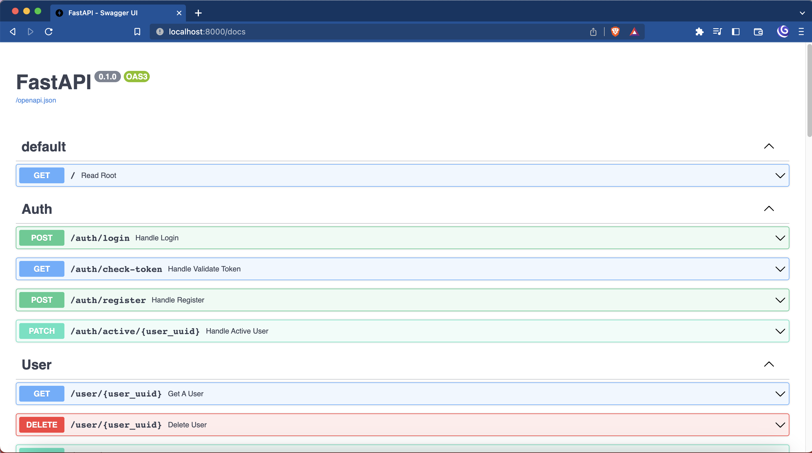
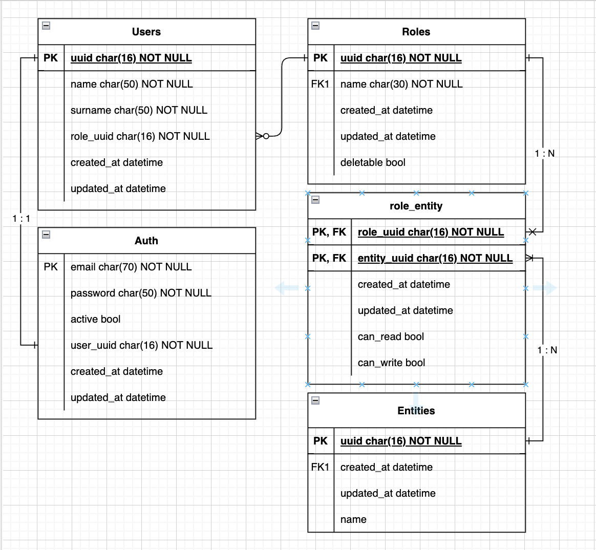

Change to [portuguese version](./documentation/readme_pt.md)

# Summary
* [Goal](#goals)
* [Technologies and Tools](#technologies-and-tools)
* [Setting up](#setting-up)
* [Running in your machine](#running-in-your-machine)
* [Running on Docker/docker-compose](#running-on-docker--docker-compose)
* [Accessing the documentation](#accessing-the-documentation)
* [Database diagram](#database-diagram)

## Goals
This repository will to serve the project Mark Tattoo like your backend.

## Technologies and Tools

| #   | Technology | Objective                            |
|-----|------------|--------------------------------------|
| 1   | Alembic    | Manager the database's migrations    |
| 2   | FastAPI    | Framework to build the API           |
| 3   | Postgres   | Database                             |
 | 4   | SQLAlchemy | ORM to interact with database        |
| 5   | Swagger    | To generate the visual documentation |

----

## Setting up
Create a copy from `.env.template` to a `.env` file and review your values, update them if necessary.

> ℹ️ Information: 
> If you are going to use Docker, skip this step below.

> ⚠️ Warning: 
> To run the following commands you need have the [Python](https://www.python.org/) installed.
> We recommend the Python >= 3.11.

1- Create a virtual environment
(This granted that the project's packages don't conflict with other packages of your machine).

To create the virtual environment, type:
<pre><code>python3.11 -m venv venv</code></pre>

2 - Active your virtual environment:
<pre><code>source venv/bin/activate</code></pre>

3 - Install the dependencies, typing:

<pre><code>pip install -r requirements.txt</code></pre>

----

## Running in your machine

> ⚠️ Warning: 
> To run this command, you need run before the setion [`Setting up`](#setting-up).

In the terminal, type:
<pre><code>make server</code></pre>

---

## Running on Docker / Docker-compose
> ⚠️ Warning: 
> To run the following commands, you need have the [Docker](https://www.docker.com/) and Docker-compose installed.

> ℹ️ Information: 
> To run the docker on macOS (M1), you need type an extra command before continue.
> Type:
>  <pre><code>export DOCKER_DEFAULT_PLATFORM=linux/amd64</code></pre>

Type:
<pre><code>docker-compose up --build -d</code></pre>

Here, you already have the API and database running.
Confirm if all is correct accessing the address [http://localhost:8000/docs](http://localhost:8000/docs).

You must see a swagger page, like this:

----
## Accessing the documentation

With API running, the doc is going to be available at [http://localhost:8000/docs](http://localhost:8000/docs)

----
## Database diagram
For while, the database structure is it:

--- 
## Next steps

* Authorization system
  * Manager permissions
  * Write and read levels
* [Implement background functions](https://fastapi.tiangolo.com/tutorial/background-tasks/):
  * To send e-mails
  * To send notifications
  * And others.
