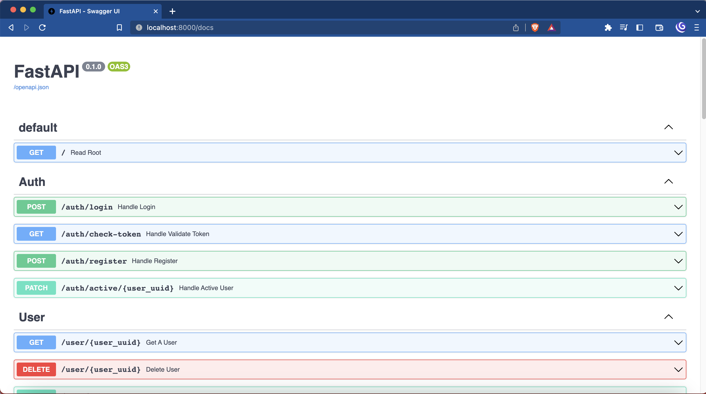
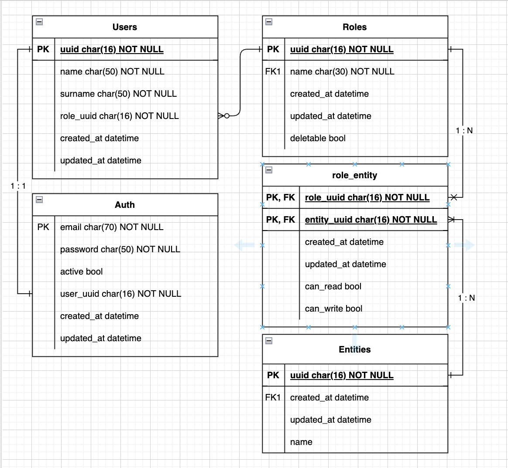

Mudar para [versão em inglês](../README.md)

# Sumário
* [Objetivo](#objetivo)
* [Tecnologias e Ferramentas](#tecnologias-e-ferramentas)
* [Configuração do projeto](#configuração-do-projeto)
* [Rodando na sua máquina](#rodando-o-projeto-em-sua-máquina)
* [Rodando via Docker/docker-compose](#rodando-via-docker--docker-compose)
* [Acessando a documentação](#acessando-a-documentação)
* [Diagrama da base de dados](#diagrama-da-base-de-dados)

## Objetivo
Este repositório servirá como backend para o projeto Mark Tattoo.

## Tecnologias e Ferramentas

| #   | Technology | Objective                               |
|-----|------------|-----------------------------------------|
| 1   | Alembic    | Gerenciar as migrações da base de dados |
| 2   | FastAPI    | Framework para construção da API        |
| 3   | Postgres   | Base de dados                           |
 | 4   | SQLAlchemy | ORM para interagir com a BD             |
| 5   | Swagger    | Gerar a documentação dos endpoints.     |

----

## Configuração do projeto
Crie uma cópia do arquivo `.env.template` e renomeie como `.env`, revise seus valores e atualize-os caso necessário.

> ℹ️ Nota: 
> Se você pretende usar o Docker, pode pular essa etapa.

> ⚠️ Aviso: 
> Para rodar os seguintes comandos você precisa ter o [Python](https://www.python.org/) instalado.
> Recomendamos utilizar o Python >= 3.11.

1- Crie um ambiente virtual.
(Isto garantirá que os pacotes do projeto não conflitarão com outros pacotes do seu computador).

Para criar o ambiente virtual, digite:
<pre><code>python3.11 -m venv venv</code></pre>

2 - Ative seu ambiente virtual:
<pre><code>source venv/bin/activate</code></pre>

3 - Instale as dependências, digitando:
<pre><code>pip install -r requirements.txt</code></pre>

----

## Rodando o projeto em sua máquina

> ⚠️ Aviso: 
> Para rodar esse comando, você precisa executar a seção [`Configuração do projeto`](#configuração-do-projeto) antes.

No terminal, digite:
<pre><code>make server</code></pre>

---

## Rodando via Docker / Docker-compose
> ⚠️ Aviso: 
> Para rodar os seguintes comandos, você precisa ter o [Docker](https://www.docker.com/) e o Docker-compose instalados.

> ℹ️ Nota: 
> Para rodar o comando no macOS (M1), você precisa executar um comando extra antes para continuar.
> Digite:
>  <pre><code>export DOCKER_DEFAULT_PLATFORM=linux/amd64</code></pre>

Digite:
<pre><code>docker-compose up --build -d</code></pre>

Aqui, você já estará com a API e a base de dados rodando.
Confirme se tudo está correto acessando o link [http://localhost:8000/docs](http://localhost:8000/docs).

Você deve ver uma página Swagger, como esta:

----
## Acessando a documentação

Com a API rodando, a documentação estará disponível em [http://localhost:8000/docs](http://localhost:8000/docs)

----
## Diagrama da base de dados
Por enquanto, a estrutura da base de dados é esta:

--- 
## Próximos passos

* Sistema de autorização
  * Gerenciar permissões
  * Níveis de escrita e leitura
* [Implementar funções de 2 plano](https://fastapi.tiangolo.com/tutorial/background-tasks/):
  * Enviar e-mails
  * Enviar notifications
  * E outros.

